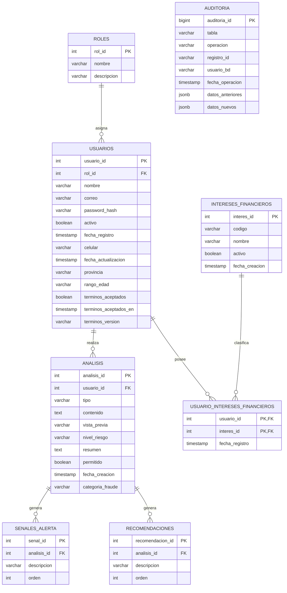

# AFB-181 — Elaborar el diagrama entidad-relación

## Objetivo
Representar visualmente las entidades, atributos principales, claves primarias, claves foráneas y cardinalidades del modelo de ALFI BOT.

## Diagrama ER

## Cardinalidades

- `roles` 1 — N `usuarios`
- `usuarios` 1 — N `analisis`
- `analisis` 1 — N `senales_alerta`
- `analisis` 1 — N `recomendaciones`
- `usuarios` N — M `intereses_financieros`, resuelta mediante `usuario_intereses_financieros`

## Justificación de relaciones

### Roles — Usuarios
Un rol puede asignarse a varios usuarios, pero cada usuario mantiene un rol dentro del sistema.

### Usuarios — Análisis
Un usuario puede realizar múltiples análisis. Cada análisis pertenece al usuario que lo generó.

### Análisis — Señales de alerta
Un análisis puede detectar cero o varias señales de alerta. Cada señal corresponde a un solo análisis.

### Análisis — Recomendaciones
Un análisis puede generar varias recomendaciones preventivas. Cada recomendación pertenece a un análisis.

### Usuarios — Intereses financieros
Un usuario puede seleccionar varios intereses y un mismo interés puede pertenecer a varios usuarios. Por ello se utiliza la tabla intermedia `usuario_intereses_financieros`.

### Auditoría
`auditoria` registra cambios realizados sobre información importante. No utiliza una FK directa hacia una sola entidad porque puede registrar operaciones de distintas tablas mediante los campos `tabla` y `registro_id`.

## Resultado
El diagrama representa el modelo relacional implementado en PostgreSQL para ALFI BOT e incluye las entidades, PK, FK y cardinalidades requeridas por AFB-181.
